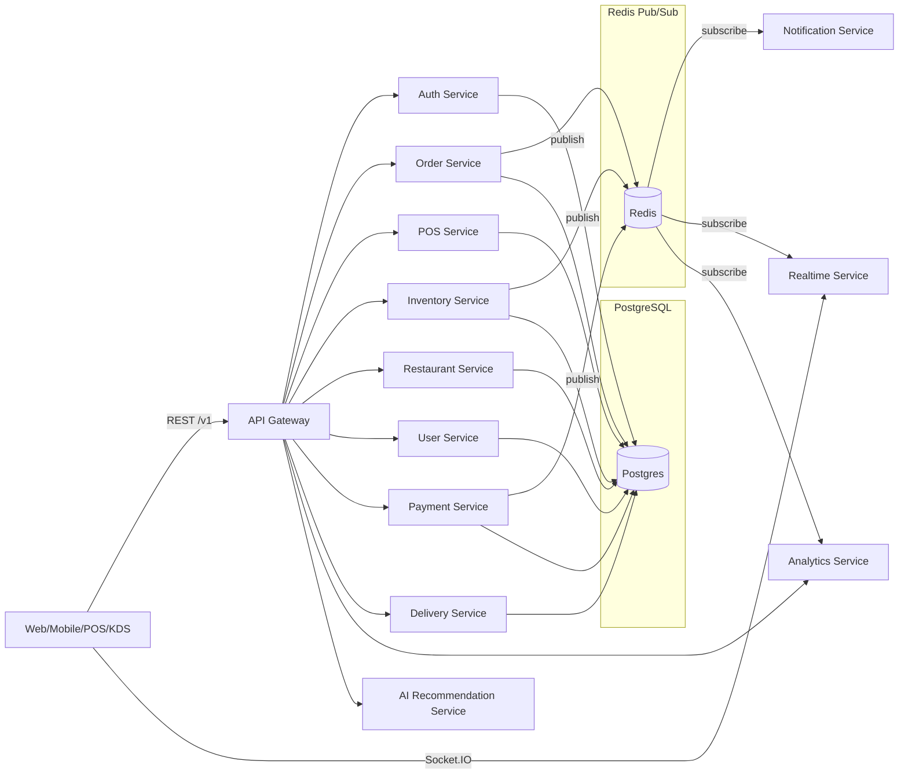

# Architecture

## Goals

- Multi-tenant SaaS for restaurants/cafes/cloud kitchens/franchises/multi-branch brands
- Microservices + event-driven for loose coupling and horizontal scaling
- Production-grade security (JWT, refresh rotation, RBAC, audit logs, rate limiting)
- Cloud-ready (Docker, reverse proxy, observability, CI)

## Service Topology

Notes:

- Current scaffold uses a single Postgres database for simplicity. In a “strict” microservices setup you can split DBs per service later.
- Events are published via Redis Pub/Sub; the [OutboxEvent](../packages/db/prisma/schema.prisma) model enables an outbox pattern for reliable publishing.

## Multi-Tenancy

- Every business entity includes `tenantId`.
- Tenant context is provided via `X-Tenant-Id` header (simplest baseline). In production you can also derive it from subdomain or JWT claims.
- Recommended next hardening step: Postgres Row Level Security (RLS) + per-tenant DB roles.

## Event-Driven Workflows

- Orders publish `order.created` after DB commit by inserting into `OutboxEvent`.
- A publisher (worker/cron) reads pending outbox events and publishes them to Redis.
- Consumers (notifications / realtime / analytics) subscribe and react.
