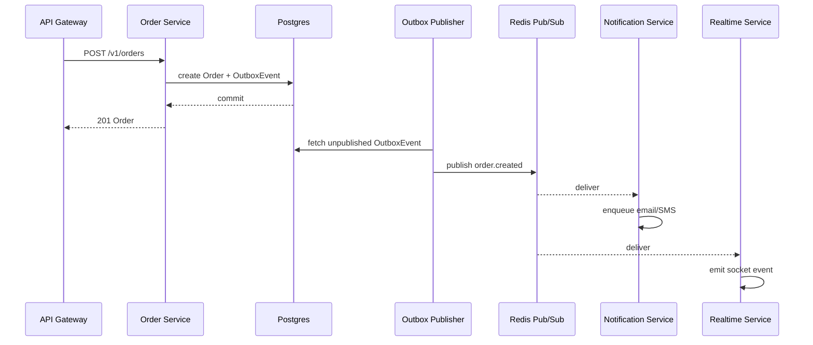

# Events & Workflows

## Envelope

Events are published as an envelope:

- `id`: unique event id
- `topic`: string topic (e.g. `order.created`)
- `ts`: ISO timestamp
- `tenantId`: tenant scope
- `payload`: JSON payload

## Topics

Defined in [packages/events/src/topics.ts](../packages/events/src/topics.ts).

## Outbox Pattern

- Producer writes business change + `OutboxEvent` in same DB transaction (recommended).
- Outbox publisher retries until publish succeeds.
- Consumers are idempotent.

## Example: Order Created

